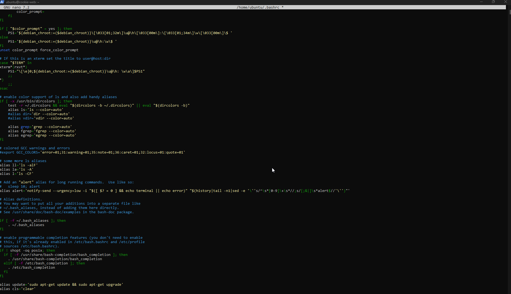
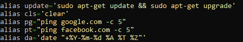
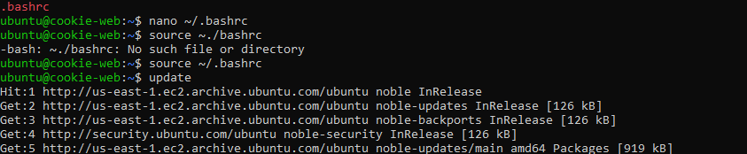
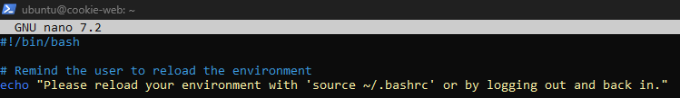
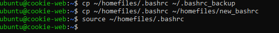
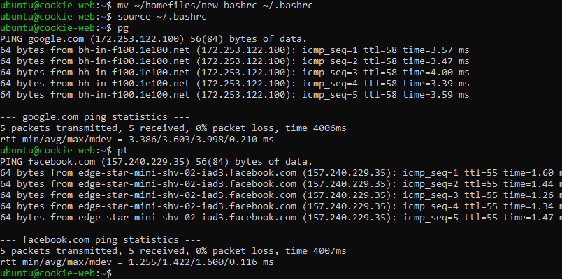

## Setting Up the .bashrc File

## Editing the `.bashrc` file

   Opening the `.bashrc` file:
   ```
   alias update='sudo apt-get update && sudo apt-get upgrade'
   alias cls='clear'
  nano ~/.bashrc
   ```
  - 

Add "awesome" bash aliases:
  ```
  alias pg="ping google.com -c 5"
  alias pt="ping facebook.com -c 5"
  ```
-  

Something cool from The Ultimate B.A. .bashrc file:
This alias shows the date

```alias da='date "+%Y-%m-%d %A %T %Z"' ```       

 

Verifying the added aliases / bash additions work and reloading the .bashrc file:
source ~/.bashrc

-  

Testing the aliases: 
update
cls
pg
pt

-  

Install Curl if required:
- To check:
  ```curl```
- To install:
  ```sudo apt-get install curl```

The Git repository is cloned using ```git clone https://github.com/jriverahmla/dotfiles.git ~/homefiles```
This command was used to copy the .bashrc file to my dotfiles repository
```cp ~/.bashrc ~/homefiles/.bashrc  ```        

Write a script
Create a script file:
```nano ~/homefiles/setup_bashrc.sh```

## Script to Remind User to Reload Environment 

## Create the Script

 Creating a script file:
   ```
   nano ~/homefiles/remind_reload.sh
```
Adding the script:
```
#!/bin/bash

# Remind user to reload environment 
echo "Please reload your environment with 'source ~/.bashrc' or by logging out and back in."
```
-  

Make the script executable:
```chmod +x ~/homefiles/setup_bashrc.sh``` 

Add / copy the script to the dotfiles repository
Copy the script:
```cp ~/homefiles/setup_bashrc.sh ~/homefiles/setup_bashrc.sh``` 

Test the new .bashrc file
Rename the current .bashrc file:
 
```mv ~/.bashrc ~/.bashrc_backup```

Copy the recovery .bashrc file to the home directory:
```cp /homefiles/.bashrc ~/.bashrc_backup```

Rename the new .bashrc file for testing:
```cp ~/homefiles/.bashrc ~/homefiles/new_bashrc```

Load the new .bashrc file:
```source ~/homefiles/.bashrc```
- 

Check for errors and verify functionality
Reload the .bashrc file:

```source ~/.bashrc_backup```
use pg and pt
- 
If everything works, replace the recovery .bashrc with the new one:

```mv ~/homefiles/new_bashrc ~/.bashrc```
Reload the final .bashrc file:

```source ~/.bashrc```


## Citations

https://github.com/vikaskyadav/awesome-bash-alias
https://gist.github.com/zachbrowne/8bc414c9f30192067831fafebd14255c
https://www.linuxquestions.org/questions/linux-software-2/linux-command-shell-bash-for-pg-658342/
https://stackoverflow.com/questions/5055059/reload-environment-variables-in-a-bash-script
https://askubuntu.com/questions/229589/how-to-make-a-file-e-g-a-sh-script-executable-so-it-can-be-run-from-a-termi
https://stackoverflow.com/questions/42131982/how-can-i-make-my-shell-script-executable
https://askubuntu.com/questions/198730/how-to-restore-bashrc-file

## Microsoft CoPilot
## Prompts:
- "What script would remind a user to reload the environment?"
- "How do you verify functionality for these two aliases?      alias pg="ping google.com -c 5" and alias pt="ping facebook.com -c 5"     "
- "What commands would I invoke to test all aliases thus far?"
