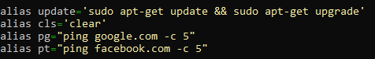
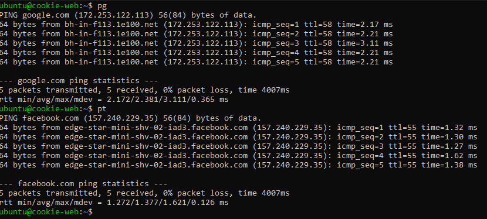

# Setting Up Your .bashrc File

## Step 1: Edit your `.bashrc` file

1. **Open your `.bashrc` file**:
   ```bash
   alias update='sudo apt-get update && sudo apt-get upgrade'
   alias cls='clear'
  nano ~/.bashrc 
  - 

Add "awesome" bash aliases:
  ```
  alias pg="ping google.com -c 5"
  alias pt="ping facebook.com -c 5"
  ```
//cite https://github.com/vikaskyadav/awesome-bash-alias
-  

Something cool from The Ultimate B.A. .bashrc file:
This alias shows the date

```alias da='date "+%Y-%m-%d %A %T %Z"' ```       

//cite https://gist.github.com/zachbrowne/8bc414c9f30192067831fafebd14255c
 

Verify your added aliases / bash additions work
Reload your .bashrc file:
source ~/.bashrc
-  

Test your aliases: //cite textbook? https://www.linuxquestions.org/questions/linux-software-2/linux-command-shell-bash-for-pg-658342/
update
cls
pg
pt

-  

Install Curl if required:
- To check:
  ```curl```
- To install:
  ```sudo apt-get install curl```

To copy the .bashrc file to your dotfiles repository
```cp ~/.bashrc ~/homefiles/.bashrc  ```        

Write a script
Create a script file:
```nano ~/homefiles/setup_bashrc.sh```      //CoPilot
-  

# Script to Remind User to Reload Environment //[cite](https://stackoverflow.com/questions/5055059/reload-environment-variables-in-a-bash-script)

## Create the Script

1. **Create a script file**:
   ```bash
   nano ~/homefiles/remind_reload.sh
Add the script content:
```
#!/bin/bash

# Remind user to reload environment //CoPilot
echo "Please reload your environment with 'source ~/.bashrc' or by logging out and back in."
 
```
Make the script executable:
```chmod +x ~/homefiles/setup_bashrc.sh``` // https://askubuntu.com/questions/229589/how-to-make-a-file-e-g-a-sh-script-executable-so-it-can-be-run-from-a-termi

Add / copy the script to your dotfiles repository
Copy the script:
```cp ~/homefiles/setup_bashrc.sh ~/homefiles/setup_bashrc.sh``` //cite https://stackoverflow.com/questions/42131982/how-can-i-make-my-shell-script-executable
-  

Test your new .bashrc file
Rename your current .bashrc file:

```mv ~/.bashrc ~/.bashrc_backup```

Copy the recovery .bashrc file to your home directory:
```cp /path/to/recovery_bashrc ~/.bashrc```

Rename your new .bashrc file for testing:
```cp ~/homefiles/.bashrc ~/homefiles/new_bashrc```

Load your new .bashrc file:
```source ~/homefiles/.bashrc //cite https://askubuntu.com/questions/198730/how-to-restore-bashrc-file```
- 

Check for errors and verify functionality
Reload your .bashrc file:

```source ~/.bashrc```
use pg and pt

If everything works, replace the recovery .bashrc with your new one:

```mv ~/homefiles/new_bashrc ~/.bashrc```
Reload the final .bashrc file:

```source ~/.bashrc```
