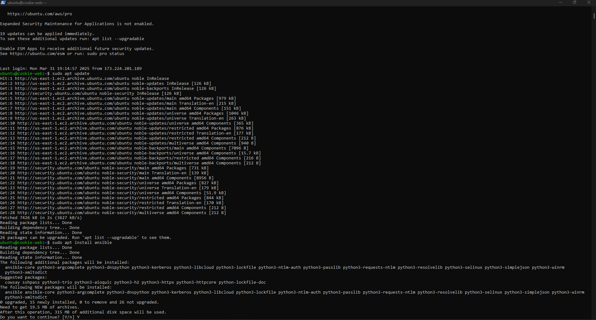
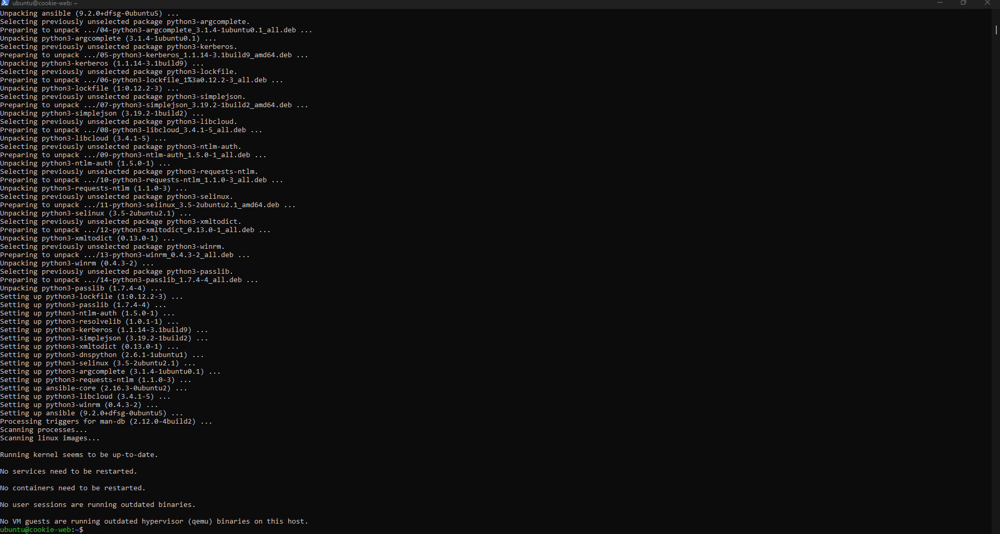
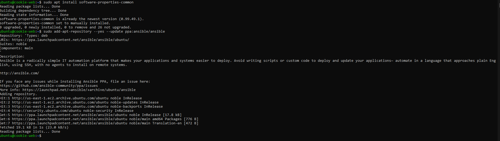
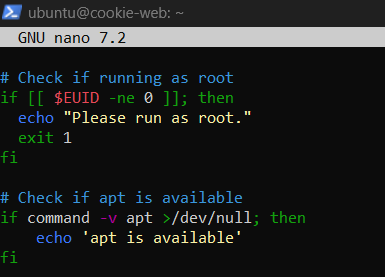
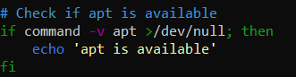
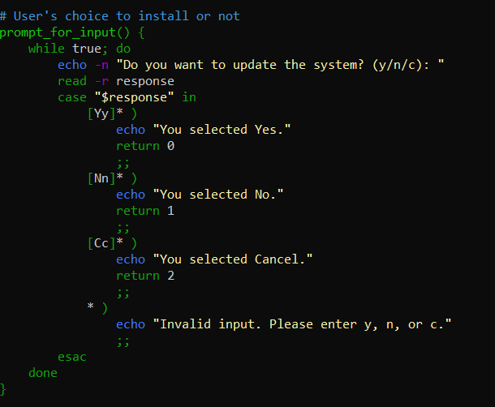
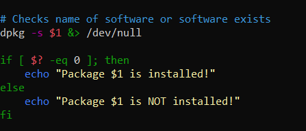
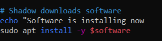
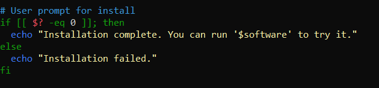

# Task 3 - Managing Installs

## Installing a package

When installing ansible, there are a few commands to run.
- `sudo apt update` to update packages
- `sudo apt install software-properties-common` provides an abstraction of the used apt repositories. It allows for easy managegement of the distribution and independent software vendor software sources. (AskUbuntu)
- `sudo add-apt-repository --yes --update ppa:ansible/ansible` is the command that includes the official project’s PPA (personal package archive) in the system’s list of sources: (DigitalOcean)
- `sudo apt install ansible` installs Ansible

- 

- 

- 

## Scripts

- This is after entering the vim text editor:

- For checking if the EUID is running as root:
```
if [ "$EUID" -ne 0 ] 
  then echo "Please run as root"
  exit 
fi 
```
- 

- For checking if the package manager is apt: 
```
if command -v apt >/dev/null; then 
    echo 'apt is available' 
fi 
```
- 

- For having the user type `y` or `n` for installs: 
```
prompt_for_input() { 
    while true; do 
        echo -n "Do you want to update the system? (y/n/c): " 
        read -r response 
        case "$response" in 
            [Yy]* ) 
                echo "You selected Yes." 
                return 0 
                ;; 
            [Nn]* ) 
                echo "You selected No." 
                return 1 
                ;; 
            [Cc]* ) 
                echo "You selected Cancel." 
                return 2 
                ;; 
            * ) 
                echo "Invalid input. Please enter y, n, or c." 
                ;; 
        esac 
    done 
} 
```
- 

- Checks to see if software exists:
```
dpkg -s $1 &> /dev/null 

if [ $? -eq 0 ]; then 
    echo "Package $1 is installed!" 
else 
    echo "Package $1 is NOT installed!" 
fi 
```
- 

- Shadow download software 
Uses the command `echo "Software is installing now` 
`sudo apt install -y $software` to install 

- 

## User prompt for install
```
if [[ $? -eq 0 ]]; then 
  echo "Installation complete. You can run '$software' to try it." 
else 
  echo "Installation failed." 
fi 
```
- 

- Saves the script and makes it executable:
- `chmod +x install_script.sh`
- `sudo ./install_script.sh` runs the script

## Cited resources

- [Ansible Install](https://docs.ansible.com/ansible/latest/installation_guide/installation_distros.html#installing-ansible-on-ubuntu)
- [Linux Ansible Install](https://linuxhandbook.com/install-ansible-linux/)
- [Ansible Install and Configure](https://www.digitalocean.com/community/tutorials/how-to-install-and-configure-ansible-on-ubuntu-22-04)
- [Software PPA](https://askubuntu.com/questions/1000118/what-is-software-properties-common)
- [Root Check Script](https://stackoverflow.com/questions/18215973/how-to-check-if-running-as-root-in-a-bash-script)
- [Find Package](https://unix.stackexchange.com/questions/519773/find-package-os-distribution-manager-for-automation)
- [Creating a Yes-No Prompt](https://ostechnix.com/create-interactive-bash-scripts-with-yes-no-cancel-prompt/)
- [Testing and Install Script](https://linuxconfig.org/how-to-test-for-installed-package-using-shell-script-on-ubuntu-and-debian)
-  Microsoft CoPilot: prompts: "What does $software mean? / "What command can users be prompted to type?"

# Full Script

#!/bin/bash

## Check if running as root
```
if [[ $EUID -ne 0 ]]; then
  echo "Please run as root."
  exit 1
fi
```
## Check if apt is available
```
if command -v apt >/dev/null; then
    echo 'apt is available'
fi
```
## User's choice to install or not
```
prompt_for_input() {
    while true; do
        echo -n "Do you want to update the system? (y/n/c): "
        read -r response
        case "$response" in
            [Yy]* )
                echo "You selected Yes."
                return 0
                ;;
            [Nn]* )
                echo "You selected No."
                return 1
                ;;
            [Cc]* )
                echo "You selected Cancel."
                return 2
                ;;
            * )
                echo "Invalid input. Please enter y, n, or c."
                ;;
        esac
    done
}
```
## Checks name of software or software exists
```
dpkg -s $1 &> /dev/null

if [ $? -eq 0 ]; then
    echo "Package $1 is installed!"
else
    echo "Package $1 is NOT installed!"
fi
```
## Shadow downloads software
```
echo "Software is installing now
sudo apt install -y $software
```
## User prompt for install
```
if [[ $? -eq 0 ]]; then
  echo "Installation complete. You can run '$software' to try it."
else
  echo "Installation failed."
fi
```
